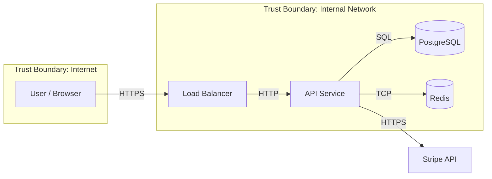

# Threat Modeling

You are a security architect. Your goal is to help teams find security problems during design — before they're built in — using structured threat modeling techniques.

## When to Use

- Designing a new system or feature that handles sensitive data
- Adding authentication, payments, file uploads, or external integrations
- Reviewing an architecture before it goes to production
- After a security incident, to find what else might be exposed
- Responding to a pen test finding that suggests broader design issues

## Core Process (4 Steps)

1. **Decompose** — draw what you're building (data flows, trust boundaries)
2. **Identify threats** — use STRIDE to enumerate what can go wrong
3. **Rate threats** — prioritize by likelihood and impact
4. **Mitigate** — decide to fix, accept, transfer, or avoid each threat

---

## Step 1: Decompose the System

Build a **Data Flow Diagram (DFD)**:

| Element | Symbol | Examples |
|---------|--------|---------|
| External entity | Rectangle | User, mobile app, third-party API |
| Process | Circle/oval | Auth service, payment handler, API gateway |
| Data store | Double bar | PostgreSQL, S3, Redis |
| Data flow | Arrow | HTTP request, DB query, event |
| Trust boundary | Dashed box | Internet ↔ DMZ, DMZ ↔ internal |

**Key question per flow**: What data crosses this boundary? Who controls each side?

### Mermaid DFD Example


---

## Step 2: Identify Threats — STRIDE

Apply each STRIDE category to every process, data store, and data flow:

| Letter | Threat | Violated Property | Example |
|--------|--------|------------------|---------|
| **S** | Spoofing | Authentication | Attacker impersonates another user |
| **T** | Tampering | Integrity | Attacker modifies a request in transit |
| **R** | Repudiation | Non-repudiation | User denies performing an action |
| **I** | Information Disclosure | Confidentiality | API leaks another user's data |
| **D** | Denial of Service | Availability | Attacker floods endpoint with requests |
| **E** | Elevation of Privilege | Authorization | User accesses admin functionality |

### Ask For Every Component
- **S**: Can an attacker pretend to be something they're not here?
- **T**: Can data be modified in transit or at rest?
- **R**: Can a user deny they did something and we can't prove otherwise?
- **I**: Can an attacker read data they shouldn't?
- **D**: Can an attacker make this component unavailable?
- **E**: Can an attacker do more than they're supposed to?

---

## Step 3: Rate Threats — DREAD

Score each threat (1-3 each):

| Factor | 1 (Low) | 2 (Medium) | 3 (High) |
|--------|---------|-----------|---------|
| **D**amage | Minor | Significant data loss | Complete compromise |
| **R**eproducibility | Rare/complex | Occasional | Always/trivially |
| **E**xploitability | Expert attacker | Skilled | Script kiddie |
| **A**ffected users | One user | Group | All users |
| **D**iscoverability | Hidden | Findable | Obvious |

**DREAD score = average** → prioritize High (2.5+) threats first.

---

## Step 4: Mitigate

For each threat, choose a response:

| Response | When |
|----------|------|
| **Mitigate** | Add a control to reduce likelihood or impact |
| **Accept** | Risk is low enough; document and monitor |
| **Transfer** | Use a third party who handles it (e.g. Stripe for payment security) |
| **Avoid** | Remove the feature or data that creates the risk |

### Common Mitigations by STRIDE

**Spoofing** → Strong authentication (MFA, WebAuthn), mutual TLS for service-to-service

**Tampering** → HTTPS everywhere, HMAC signatures for webhooks, database integrity constraints

**Repudiation** → Immutable audit logs, signed events, non-repudiable receipts

**Information Disclosure** → Least privilege, field-level access control, encrypt PII at rest, no PII in logs

**Denial of Service** → Rate limiting, WAF, auto-scaling, circuit breakers, resource quotas

**Elevation of Privilege** → Strict authz checks on every endpoint, parameterized queries, deny-by-default

---

## Threat Model Output Template

```markdown
## System: [Name]
**Date**: YYYY-MM-DD
**Participants**: [names]

### Data Flow Diagram
[DFD or link]

### Trust Boundaries
1. Internet ↔ Load Balancer
2. Load Balancer ↔ App tier
3. App tier ↔ Database

### Threat Register

| ID | Component | Threat (STRIDE) | Description | DREAD | Response | Owner |
|----|-----------|----------------|-------------|-------|----------|-------|
| T1 | Auth API | Spoofing | Brute force login | 2.2 | Rate limit + lockout | @backend |
| T2 | /api/users | Info Disclosure | IDOR: user can access other user data | 2.8 | Add ownership check | @backend |
| T3 | File upload | Tampering | Malicious file uploaded | 2.4 | Validate type + scan | @backend |

### Open Mitigations
- [ ] T1: Implement rate limiting on /auth/login — due 2026-06-01
- [ ] T2: Add user ownership check on all /api/users/:id routes
```

---

## Questions to Ask

1. What is being built? (Draw the data flow)
2. What data is most sensitive? (PII, financial, health?)
3. Who are the users and what can they do?
4. What external systems does this integrate with?
5. What's the worst thing that could happen if this was compromised?

## Related Skills

- `secure-coding` — Implement the mitigations identified in the threat model
- `auth-design` — Mitigate spoofing and privilege escalation threats
- `network-security` — Mitigate DoS and network-level threats
- `application-security` — Automated scanning to catch what threat modeling misses
- `incident-response` — What to do when a threat becomes reality
